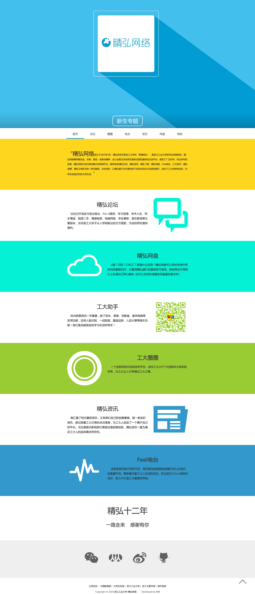

##2014-09-30更新 -------v0.9

- 去除了不稳定的平滑滚动
- 重写前端页面
- 去除了幻灯片轮播
- 增加产品介绍以及动画效果
- 将自动加载大事件改为点击加载，减少阅读压力和服务器负担
- 删除了一些不必要的插件

##需要修改的配置项

- [ Apache ] httpd.conf配置文件中加载了mod_rewrite.so模块 
- [ Apache ] AllowOverride None 将None改为 All 

- Index/Common/Conf/config.php里面的数据库配置
- Index/Home/View/index/index.html 里面的url（js开始处的三个）
- Index/Admin/View/index/admin.html 里面的url（js开始处的十二个）

- 数据库结构

##预览
